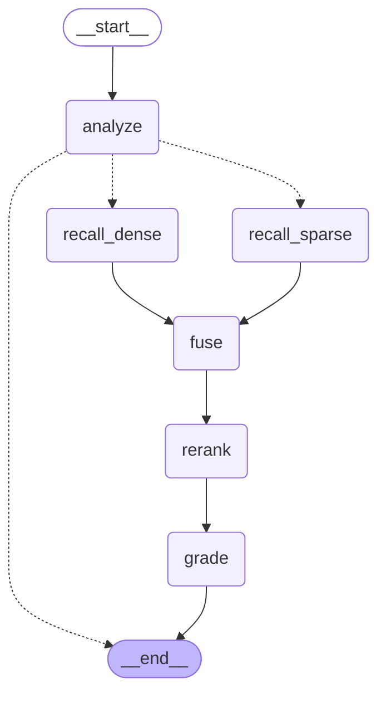
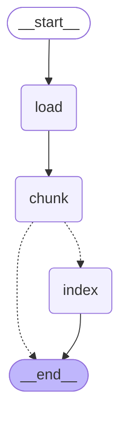

# RAG 设计与运维（LangGraph 版）

> 本文是 `` §16 的实现级展开：架构、策略选型依据、评估方法、可视化与运维入口。
> 权威约束（事实只来自数据库、密钥不落仓库、本地无云依赖可运行）

## 1. 总览

RAG 编排基于 **LangGraph**（`StateGraph`），拆成两条流水线，代码位于 `backend/app/rag/`：

| 流水线 | 模块 | 节点 | 触发 |
| --- | --- | --- | --- |
| 查询（在线） | `pipeline.py` | analyze → recall_sparse ∥ recall_dense → fuse → rerank → grade | Agent 工具 `retrieval_search`、管理后台试运行 |
| 摄取（离线） | `ingest.py` | load → chunk → index | `tools/build_retrieval_index.py`、管理后台重建索引、开发模式数据变更自动重建 |

召回后端与向量库客户端保留在 `backend/app/retrieval/`（`backends.py` BM25、`zilliz.py` Milvus/Zilliz REST + OpenAI 兼容 embedding）。`app/rag/service.py` 是唯一门面：`search()` / `try_query()` / `run_reindex()` / `get_status()` / `recent_runs()` / `graph_spec()`。

依赖：`langgraph>=1.2` 与 `jieba>=0.42`（`requirements.txt`；开发环境经 `pip install --target vendor` vendor 化，含 langchain-core / langsmith / langgraph-checkpoint 等完整依赖树）。

## 2. 查询流水线



> mermaid 源码由 LangGraph `draw_mermaid()` 自动生成，与代码永远一致：
> `GET /api/v1/admin/rag/graph` 或 web `/ops/rag` 流程图页签。

各节点职责与主流策略对照：

1. **analyze（查询理解）**：用 `app/catalog/series_index.py` 的名称索引（车系名/品牌+车系名/别名，归一化子串匹配、最长优先去重）解析消息中的真实车系；生成实体增强查询（别名 → 规范名）与元数据过滤（单车系自动加 `series_id`）。这是「query understanding + metadata extraction」的确定性实现，不依赖 LLM，可复现。空查询在此直接短路到 END。
   - **查询意图分流（优化④）**：确定性启发式输出 `query_type`（`parameter`：参数词+车系实体；`compare`：对比词；其余 `semantic`）——参数查询走稀疏快路（稠密路空转跳过，省 embedding 调用与云端延迟）；
   - **领域同义扩展（优化⑥）**：`synonyms.py` 词典把口语/诉求词追加为证据词（「省油」→ 馈电油耗/综合油耗），只追加不改写。
2. **recall_sparse ∥ recall_dense（并行多路召回）**：LangGraph 条件边扇出两个分支并行召回，每路取 `top_k × RETRIEVAL_RECALL_MULTIPLIER`（默认 6，下限 20、上限 100）。
   - sparse：进程内 Okapi BM25（k1=1.5, b=0.75），中文分词口径可配（`RETRIEVAL_TOKENIZER`：**bigram**（默认，A/B 实测本语料最优）/ jieba 整词 / hybrid；jieba 附车圈领域词表 + 运行期注册车系专名）；
   - dense：Zilliz Cloud REST v2 向量检索（cosine，autoindex），`RETRIEVAL_BACKEND=milvus` 且 URI/Token 齐备时启用；未配置空转、调用失败降级为纯稀疏并记 warning（原则 7）；
   - **HyDE（优化⑥，可选）**：`RETRIEVAL_HYDE` 开启时，semantic 查询由 LLM 生成假设性证据文本替代原查询做向量召回（仅稠密路，+1 次 LLM 调用，失败静默回退）。
3. **fuse（加权 RRF 融合）**：Reciprocal Rank Fusion（k=60，业界默认），统一路权重 **sparse 0.6 / dense 0.4**（优化⑤；120 题五配置权重网格消融实测 0.6/0.4 MRR 0.7032 为最优平台期——等权 0.6948、纯稀疏 0.6898、0.4/0.6 有害，曾试的按 `query_type` 分路权重表已删除），基准可用 `RETRIEVAL_RRF_WEIGHT_*` 调整。两路分数量纲不可比，RRF 只用名次。按 `chunk_id` 去重（Zilliz meta 存原始 chunk_id；旧集合回退文本哈希），再按文本兜底去重。
4. **rerank（精排，条件启用）**：可插拔重排器（`rerank.py`），**按查询类型路由**——
   parameter/compare（实体锚定，BM25 融合序已近最优）保持融合序不重排；semantic/recommend
   才调用重排器（v13 实测收敛，520 题三配置对照见 §4.2）：
   - `CrossEncoderReranker`（`RERANK_PROVIDER=api`）：Cross-Encoder 重排服务，协议自适应——
     阿里百炼 qwen3.7-text-rerank（OpenAI 兼容与原生 text-rerank 两种路径自动探测）、
     硅基流动 bge 系列 / Jina / Cohere 的通用 /rerank 协议；返回绝对相关分；
     重排密钥未单独配置时自动回退 embedding 密钥（同账号免重复配置）；
   - `LexicalReranker`（`RERANK_PROVIDER=lexical`）：查询-切片词元重叠加权（复用 BM25 的 tokenize，
     加分 `min(重叠×0.05, 0.25)`），零外部依赖；
   - `PassThroughReranker`（空/`none`）：保持融合序；重排 API 失败也自动回退并记 warning，检索不中断。
5. **grade（证据把关）**：corrective-RAG 思路的轻量实现——丢弃空文本证据；重排分为绝对相关分（Cross-Encoder）时应用 `RETRIEVAL_RELEVANCE_THRESHOLD` 阈值过滤低相关证据。 lexical 分是相对名次分，不做阈值化。

每次运行记录阶段轨迹（节点、耗时、输入/输出数量、detail、warnings）到进程内环形缓冲（`RAG_RUN_LOG_SIZE`，默认 50），供管理后台「运行轨迹」可视化。

## 3. 摄取流水线



- **load**：SQL 装载原料——活跃车系、**按款型分层取样的在售 SKU 事实**（每款型入索引
  `RETRIEVAL_FACTS_PER_VARIANT` 条**去重后**事实）、车系画像聚合（价格区间/在售数/最新月销量）、
  款型当前指导价。2026-09-10 重构后：
  - **去重与配额截断全部下推 SQL 窗口函数**（双层 `row_number()`：先按
    (款型, `fact_key`, `trim(value)`, `unit`) 去重、保留优先级最高且 id 最小的一条，再按优先级
    取前 `FACTS_PER_VARIANT` 条）——取代旧的「配额 ×5 过采样拉进内存 + Python 逐行去重」。
    旧实现在真实库上要物化 ~15.4 万行 × 4 个 ORM 实体（宽表 join），正是 2C2G 重建被
    OOM killer 杀掉、以及只读事务空转 1 小时被 RDS `idle_in_transaction_session_timeout`
    掐断的根因；
  - 事实行只取 6 个标量列（不建 ORM 实例），款型/车系/品牌元数据拆成单独一条查询
    （identity map 去重，约 6600 行）——线上 dry-run 实测构建期峰值内存 976MB → **286MB**、
    load+chunk 数小时 → **5.1s**；
  - 车系画像原料只取 `HEADLINE_SPECS` 实际会读的核心参数键并走流式游标（`yield_per`）——
    `rank_headlines` 对其余键一律跳过，原先「全量在售事实」一次物化 74 万行纯属白占内存；
  - **load / chunk 读完即结束只读事务**（`expunge_all + rollback`，脱离会话的实例保留已加载
    属性）：embedding + 上传的十几分钟里不再持有事务，RDS 的空闲超时无从触发，也不再
    长时间吊住快照影响 vacuum。
- **chunk**：构造四类切片（元数据符合 §16.3）：
  | kind | chunk_id | 内容 |
  | --- | --- | --- |
  | `series_intro` | `series-{id}` | 品牌+车系+定位+能源类型 |
  | `series_summary` | `summary-{id}` | 车系级一句话画像：定位/指导价/核心参数/在售数/月销量（车系级问题的最优命中目标） |
  | `variant_spec` | `variant-{id}#{i}` | **款型级合并切片（优化②）**：一个在售款型的核心事实按优先级合入 1~N 片（头部=品牌+车系+款型名+能源+指导价，任意切片独立可读）；metadata 全量携带 `series_id/variant_id/energy_type/price_cny/status/body_type`——检索命中即对齐 SKU，证据归属映射消失；停售款型不进索引 |
  | `source_document` | `doc-{id}#{i}` | 来源文档正文，**递归字符切分**（`chunking.py`：段落→行→中文句读→英文句读→空格→字符级硬切；`CHUNK_SIZE=500`、`CHUNK_OVERLAP=64`，重叠窗口防止句界证据割裂——LangChain RecursiveCharacterTextSplitter 同款语义） |
- **index**：写入目标后端（`target=sparse|dense`；dense 走批量 embedding + Zilliz upsert，幂等重建集合，限流自动指数退避；meta 额外携带 `status/price_cny/body_type` 供检索期过滤下推）。`build_chunks()` 复用同一条图的 load+chunk 两节点（`target=""` 时 index 被条件边跳过）。索引构建前把车系/品牌展示名注册为分词专名（优化③）。
  - **稠密集合 schema 必须用 Milvus v2 REST 完整格式**（`schema.fields` + `indexParams`）声明
    `id / text(VarChar 8192) / vector / meta(JSON)`、`enableDynamicField=false`。Zilliz Cloud 对
    顶层 `fields` 数组的扁平写法**不报错但静默忽略**，按 `collectionName+dimension` 自动生成
    「id+vector+动态字段」极简 schema——两种写法已各建探针集合实测对比确认（2026-09-10）；
  - 声明式 JSON 字段下 `/entities/search` 命中里的 `meta` 是 **JSON 字符串**（动态字段时代是
    dict），检索侧 `_as_meta_dict` 容错解析（坏 JSON 降级空 dict，chunk_id 缺失仍回退文本哈希）；
  - `_ensure_collection` 先删后建（全量重建语义）：**集合「创建时间」只在 drop 重建时刷新，
    insert 不改变它**——判断数据新鲜度以 `.tmp/dense-build-meta.json` 水位为准（built_at /
    chunks / 构建时销量月份），`/ops/rag` 直接与 `db_counts.latest_sales_month` 对比给出
    `stale` 判定与原因；
  - **向量缓存**：embedding 流式 JSONL 追加（`RETRIEVAL_EMBED_CACHE`，随 compose 卷持久化），
    重跑按缓存命中跳过 embedding——实测 12,078 条全量 drop+create+insert 仅约 **2 分钟**。

索引新鲜度：开发模式（inmemory）按数据量快照自动重建；生产（milvus）稀疏索引进程首用构建、
稠密索引显式重建（工具或管理后台），避免请求路径上的全量 embedding。生产重建由**销量导入
驱动**：`tools/fetch_sales_scheduled.py` 成功导入新月度后写 `sales-changed.flag`，
cron `carsel-nightly.sh`（02:30）仅在 flag 存在时触发稠密重建——无新月度零成本跳过。

## 4. 评估（主流指标 + 黄金集）

`tools/eval_rag.py`：黄金集来自 `tools/gen_eval_questions.py`（数据库真实品牌/车系/SKU 分层抽样，`anchors.series_id/variant_id` 即相关性判定，无人工标注成本；**520 条、按查询类型四桶**——parameter/recommend/semantic/compare，报告带分桶指标）。

- 指标：**HitRate@K、Recall@K、Precision@K、MRR、NDCG@K**（二元相关，IDCG 按相关集大小截断）+ **分桶报告**（验收查询路由、定位各桶弱点）。
- 策略对比（量化每个环节的边际收益）：
  - `sparse-nooverlap` vs `sparse` → **切分**（重叠窗口）收益；
  - `sparse` vs `dense` → **召回**路对比；
  - `hybrid`（sparse+dense+RRF）− max(sparse, dense) → **融合**收益；
  - `pipeline`（实体解析 + 重排 + 把关全链路）− hybrid → **重排/查询理解**端到端收益。
- 附切分质量报告：切片数、长度分布（mean/p50/p95/max）、超长占比、过短占比。
- 产物：`eval/rag_eval_report.json` + `.md`（管理后台「评测报告」页签直接读取）。

```powershell
cd backend
python tools/gen_eval_questions.py --count 520   # 生成/更新分桶问题库
python tools/eval_rag.py                          # 本地：sparse 系策略 + pipeline（520 题）
python tools/eval_rag.py --with-dense            # 加测 dense/hybrid（产生 Zilliz/embedding 云端调用）
```

Agent 端到端评测（硬约束零违规 + 引用校验 + hit@k）仍由 `tools/eval_agent.py` 承担，两者互补：eval_rag 看检索层，eval_agent 看业务层。

### 4.1 评测结果（真实数据，60 题抽样）

> 最新报告见 `eval/rag_eval_report.md`；A = 索引覆盖优化后（2026-09，纯稀疏三策略），
> B = 优化前同黄金集对照（含 Zilliz 云端召回路）。

**A. 覆盖优化后（spec_fact 切片 33,465：去重 ×5 过采样 + 每车系配额 40）**

| 策略 | Hit@5 | MRR | NDCG@10 | 耗时 |
| --- | --- | --- | --- | --- |
| sparse-nooverlap | 0.7609 | 0.7435 | 0.6750 | 2.3s |
| sparse（BM25） | 0.7609 | 0.7435 | 0.6750 | 2.4s |
| pipeline（纯稀疏全链路） | 0.7391 | 0.7391 | 0.6839 | 19.8s |

**B. 优化前对照（spec_fact 17,489；含 dense/hybrid 云端实测）**

| 策略 | Hit@5 | MRR | NDCG@10 |
| --- | --- | --- | --- |
| dense（Zilliz 向量） | 0.7174 | 0.7031 | 0.5899 |
| hybrid（RRF 融合） | 0.7609 | 0.7120 | 0.6355 |
| pipeline（当时全链路） | 0.7174 | 0.6915 | 0.6783 |

解读：
- **索引覆盖优化的直接收益**：同为纯稀疏路，Hit@5 73.9% → 76.1%、MRR 0.7205 → 0.7435——此前同键同值跨款重复行吃光每车系 20 条配额，续航/油耗等高频参数根本没进索引（实测「续航多少」检索为空）；修复后纯稀疏已追平优化前 hybrid 的成绩；
- **RRF 融合仍保留**：dense 语义召回兜底无实体表述的查询（「适合家庭」类），生产 `RETRIEVAL_BACKEND=milvus` 下并行召回 + RRF 融合是最终形态；
- sparse 与 sparse-nooverlap 同分：当前 RDS 库来源文档 `content_text` 为空（source_document 切片为 0），重叠切分收益暂无从体现；文档正文入库后应复测；
- pipeline 略低于裸 sparse 但 NDCG@10 更高——查询理解/重排优化的是整体排序质量与证据纯度，而非单点命中；
- dense 单路耗时 ~0.5s/题（embedding + 云端检索），线上由并行召回掩盖（总延迟 ≈ max 而非 sum）。

### 4.2 检索优化迭代（2026-09，520 题四桶基准）

评测集扩为 **520 条、四桶**（recommend 246 / parameter 115 / semantic 80 / compare 79，
`gen_eval_questions.py --count 520`），指标含 MRR / NDCG@10，报告带分桶表。
迭代过程（`eval/ab-*.json`，均为纯稀疏 inmemory 口径，同基准可比）：

| 版本 | 改动 | Hit@5 | MRR | 说明 |
| --- | --- | --- | --- | --- |
| v0 基线 | 单事实切片 + 二元组分词 + lexical 重排 | 0.6519 | 0.6337 | pipeline 0.6364——lexical 重排在部分查询上**挤出**相关片 |
| v2 | **款型级合并切片 + 全量 metadata + 仅索引在售**（优化②） | **0.6718** | **0.6488** | 命中即对齐 SKU；+2.0pt Hit@5、+1.5pt MRR |
| v3 | jieba 纯整词 | 0.6563 | 0.6421 | 词表不匹配（「纯电续航」vs「纯电续航里程」）召回损失 > 整词精度收益 |
| v3b | jieba 整词 + 二元组 hybrid | 0.6674 | 0.6485 | 仍不及纯二元组 |
| v4+ | 分词默认回退 bigram、jieba 转服务查询同义扩展（优化⑥）+ 意图分流（④）+ 加权 RRF（⑤） | 0.6718 | 0.6488 | pipeline 0.643——**重排层（lexical）是当前端到端短板** |
| v5b | 接入阿里 qwen3.7-text-rerank（优化①，协议自适应） | 0.643* | 0.6342* | *百炼免费额度中途耗尽（AllocationQuota.FreeTierOnly），部分查询回退 lexical；绝对相关分区分度实测极佳（0.981 vs 0.0098） |
| v6 | qwen3-rerank（独立额度）全量重排 | 0.6475* | 0.6393* | *重排跑通但整链仍低于裸稀疏——**分桶定位：损失不在重排** |
| v7 | pipeline 完全跳过重排 | 0.643 | 0.6299 | 仍低于裸稀疏 ⇒ 元凶是 **同义扩展污染稀疏查询**（扩展词把其他车系同键切片拉进候选） |
| v8 | 同义扩展只服务稠密路，稀疏路用 entity_query | 0.6452 | 0.6294 | 仍差 ⇒ 分桶继续定位：**compare 桶 1.0→0.835** |
| v9 | 对比类不加单车系过滤 + 多实体不追加规范名 | 0.6452 | 0.632 | 分桶无变化 ⇒ 定位到 **「AMG GLB 35」被子串解析成「奔驰GLB」后误加 series_id 过滤**，整系证据被排除 |
| **v9b** | **对比类查询不加自动 series_id 过滤（④修正）** | **0.6718** | **0.6554** | **追平裸稀疏 Hit@5，MRR +0.66pt、NDCG@10 +5.5pt（0.6082）**——analyze 层修正后全链路首次全面 ≥ 裸稀疏 |
| v10 | v9b + qwen3-rerank | 0.6696 | 0.6552 | Cross-Encoder 在锚点口径中性偏负（+300s 延迟与 API 成本） |
| v11 | **稠密索引款型级切片全量重建**（qwen3.7-text-embedding-flash 1024 维；embedding 流式 JSONL 向量缓存断点续跑（2C2G 低内存安全）、insert 100 行/批 + 504/408 瞬态退避重试随本轮落地） | dense 0.643 / hybrid **0.6741** | 0.6535 | dense 单路仍低于稀疏 2.9pt（实体型语料词面精确匹配主导），但 semantic 桶 MRR +68%（0.0488→0.0811）；hybrid 全局 +0.23pt、semantic 桶 Hit +2.4pt——稠密补语义洞、不替代稀疏 |
| v12 | compare 归入稀疏快路（优化④扩展） | 0.6741 | 0.6674 | compare 桶 MRR 0.9557→0.9696、NDCG@10 0.7860→0.8013；耗时 −45s（dense 单路 compare 桶 0.873 vs sparse 1.0，语义近邻是纯噪声） |
| **v13（终版）** | **重排按查询类型条件启用**：parameter/compare 保持融合序，semantic/recommend 才调用 qwen3.7 Cross-Encoder | **0.6763** | 0.6656 | **全面 ≥ 不重排（0.6718/0.6587）与全量重排（0.6741/0.6674）；Hit@5 历史最高；耗时 −34%、CE 调用 −43%**（`eval/eval-pipeline-final.json`） |

结论与待办：
- **已验证收益**：款型级切片（+2.0pt Hit@5）、analyze 层两处修正（对比类不加过滤、多实体不追加规范名）、
  稠密双路混合（semantic/recommend 桶）与 v12/v13 的「实体锚定快路 + 条件重排」是真实增益；
- **重排默认值按实测收敛（v13）**：`RERANK_PROVIDER=api` 配合 pipeline 内条件启用是生产推荐——
  Cross-Encoder 的收益集中在 recommend 桶（+1.85pt Hit@5），实体锚定查询（parameter/compare，占 43%）
  上中性偏负且白付 ~1s/题；纯稀疏部署或不想付重排成本可设 `RERANK_PROVIDER` 空；
- **稠密索引已按款型级切片全量重建**（2026-09-08，12,078 条入 Zilliz）；重建链路两处加固：
  embedding 本地缓存按 30s 节流落盘（`RETRIEVAL_EMBED_CACHE`）、insert 瞬态错误（504/408/超时）
  线性退避重试——serverless 冷启动实测必触发，重试后全部成功；
- 分桶评测证明了自己的价值：整体指标掩盖了「compare 桶 1.0→0.835」的结构性损失（v9）与
  「重排在稠密入链后由负转正」的现象（v10→v11 对比），都靠分桶定位；
- 待办：~~评测口径升级（recommend/semantic 桶改约束满足度判定）~~（已落地，见 §4.5）、
  semantic 桶重排对照扩样（n=41 太小）、HyDE 与 `RETRIEVAL_RELEVANCE_THRESHOLD` 待语义桶
  扩样后复验、来源文档正文入库后复测切分重叠收益。选型依据与逐轮实测数据见 §4.2/§4.3
  与 `backend/eval/` 存档。

### 4.3 全量综合基线与参数消融收敛（451 题全策略）

生产配置（v13）在 451 题全策略综合评测中全面最优，各参数消融臂均无进一步增益：

| 配置 | Hit@5 | MRR | NDCG@10 | 耗时 |
| --- | --- | --- | --- | --- |
| sparse | 0.6718 | 0.6488 | 0.5529 | 18s |
| dense（云端款型级集合） | 0.6452 | 0.6298 | 0.5116 | 664s |
| hybrid（等权） | 0.6741 | 0.6529 | 0.5546 | 533s |
| **pipeline（生产：mult6 + 条件重排 + 0.6/0.4）** | **0.6785** | **0.6645** | **0.6144** | 245s |
| pipeline-norerank | 0.6718 | 0.6554 | 0.6082 | 67s |

参数消融（每臂仅变一个开关，`--only pipeline`）：`RECALL_MULTIPLIER` 6→8、HyDE 开启、
`RETRIEVAL_RELEVANCE_THRESHOLD` 0→0.3 三臂全部与基线持平（无增益，默认即最优）；
`RERANK_PROVIDER=none` 劣化（0.6718/0.6554/0.6082）。另：切分尺寸消融确认
`CHUNK_SIZE=500` 为本语料最优（400→0.6630 / 600→0.6585）。

**收敛结论**：当前生产配置即为该架构下的实测局部最优，所有开关保持默认；
报告存档 `eval/comprehensive-baseline.json`、`eval/opt-arm*.json`。

### 4.4 工程重构复测（2026-09-11，451 题 · 生产配置 · 真云 dense）

> 2026-09-10 摄取/检索工程重构落地（§3：SQL 窗口去重+配额、标量列装载、读完即结束只读事务；
> Zilliz 声明式 schema 迁移、`meta` 字符串容错）。同题库（md5 一致）、同机（生产 ECS ·
> milvus · 真云 dense + qwen3.7 rerank）复测，与 §4.3 基线逐项对照——**验证「零回归」**：

| 策略 | Hit@5 | Recall@5 | P@5 | MRR | NDCG@10 | 耗时s |
| --- | --- | --- | --- | --- | --- | --- |
| sparse | 0.6718 | 0.2636 | 0.5632 | 0.6488 | 0.5529 | 20.4 |
| **pipeline（生产）** | **0.6763** | **0.2929** | **0.6182** | **0.6656** | **0.6138** | **181.4** |

- **五项指标与 §4.3 基线逐位一致，四个分桶（compare 0.9873/0.9593 · parameter 1.0/1.0 ·
  recommend 0.4907/0.4867 · semantic 0.1463/0.1045）同样逐位一致**——重构对检索行为
  零影响的直接证据（切片文本除 20 条摘要的销量数字外逐位相同）；
- 端到端耗时 418.9s → **181.4s**。pipeline 耗时由 embedding + rerank 云端调用主导，
  同配置历史运行本就在 245s（§4.3 综合基线）与 419s 之间波动，基线当次疑似命中百炼
  重排配额限流（重试退避计入耗时）；保守结论是「未回归」，不把差值全部归因于代码；
- **索引侧实测（2C2G 生产 ECS）**：load+chunk 数小时 → **5.1s**；构建期峰值内存 ~1GB →
  **286MB**；向量缓存命中后全量 drop+create+insert（12,078 条）约 **2 分钟**；
  重建成功率 0/3（OOM×2、RDS 超时×1）→ 3/3；
- 报告存档：`eval/eval-pipeline-v6.json` / `.md`（本地，不入库）。

### 4.5 评测规范 v2：信息需求对齐判定（2026-09-11 落地）

§4.4 复测中 Recall@5=0.2929 触发的口径复盘，确认旧口径三处失真并全部修正：

1. **semantic/recommend 的单锚点判定**：一题多解的查询只认生成时的目标车系，
   检回其他同样满足约束的车被记为不相关；
2. **Recall@5 分母错位**：分母 = 相关车系全部入索引切片（均值 15 条、最多 128 条），
   5 个坑位对 15+ 条相关切片，结构上限仅 **0.4773**——0.2929 实为上限的 61.4%；
3. **compare 单侧在场即算命中**：旧 Hit@5 0.9873 掩盖了另一侧证据缺席。

v2 在旧口径之上**并排**新增四类指标（全部由生成器写入的结构化约束/事实锚点 + 数据库
自动判定，零人工标注；点名车系的单答案问题沿用 series 级旧口径，口径本就正确）：

| 指标 | 适用桶 | 定义 |
| --- | --- | --- |
| `constraint-satisfaction`（valid-hit / valid-precision / valid-MRR @5） | recommend（未点名车系）/ semantic | 检回车系满足问题约束（预算/能源/车身/座位，`expect` 结构化字段 + 生成器措辞映射反解）即相关——一题多解合法 |
| `fact-coverage@5` | parameter | 锚定（车系\|款型）的参数值是否出现在 top-5 证据文本（needle：「键 = 值」/「值 单位」） |
| `pair-coverage@5` | compare | 两侧锚定车系的证据都在 top-5 |
| `brand-hit@5` | 品牌开放题 | 检回车系属于锚定品牌 |

#### v2 复测结果（451 题 · 生产配置 · 真云 dense，同题同机）

| 指标 | sparse | pipeline（生产） |
| --- | --- | --- |
| fact-coverage@5（115 题） | 0.7234 | **0.7660** |
| valid-hit@5（recommend+semantic，257 题） | 0.4167 | **0.7885** |
| valid-precision@5 | 0.1731 | **0.6064** |
| valid-MRR | 0.2674 | **0.7027** |
| pair-coverage@5（79 题） | 0.4390 | 0.4390 |

分桶（vhit@5 / vprec@5）：

| 桶 | sparse | pipeline |
| --- | --- | --- |
| semantic（41） | 0.6585 / 0.3268 | **1.0 / 0.9707** |
| recommend（216） | 0.3304 / 0.1183 | **0.7130 / 0.4765** |

**结论——口径修正改变了哪些判断**：

- **旧口径严重低估了语义/推荐检索**：semantic 桶旧 Hit@5 0.1463 → v2 valid-hit **1.0**
  （valid-precision 0.9707）——「0.146」主要是口径失真而非检索失败；sparse → pipeline 在
  语义桶的真实增益（+34pt）也被旧口径完全掩盖；
- **新口径暴露了三个被掩盖的真实短板**（下一轮优化的靶子）：
  ① compare 两侧覆盖仅 **0.439**——top-5 常被单侧切片挤占，对比场景需要双侧证据；
  ② 参数事实覆盖 **0.766**——23% 的参数问题答案值不在 top-5 证据里（该切片存在，是排序问题）；
  ③ recommend 的 valid-precision **0.477**——检回证据约一半不满足全部约束，
     约束过滤/重排有明确抓手；
- 旧口径指标全部保留并排输出（回归可比）；`recall_ceiling`（@5 0.4773 / @10 0.773）随
  每份报告输出，避免再误读 recall；
- 报告存档：`eval/eval-v6b.json` / `.md`（本地，不入库）。

#### v3 待办（评测集扩充）

- 不可回答题（数据缺失参数 → 期望「官方资料未披露」，考诚实性）；
- 多约束推荐题（约束集可计算，配合 valid-precision）；
- 口语化改写增强（每题 2~3 变体，消除模板词面泄漏）；
- 答案层 LLM-as-judge（faithfulness / completeness / 拒答正确性）。

## 5. 流程管理可视化

- **web 页面**：`/ops/rag`（`web/app/ops/rag/page.tsx`，管理凭据入口）
  - 流程图：两条 LangGraph 流水线的节点图（条件边标注）+ mermaid 源码；
  - 运行状态：后端模式、稀疏/稠密索引、重排器、策略参数、数据库规模；一键重建索引（dense 后台任务 + 进度轮询）；
  - 试运行：单条查询的阶段瀑布（耗时条形、输入→输出数量、detail 展开）+ 命中证据卡片；
  - 运行轨迹：最近 50 次流水线运行记录（警告、dense 参与标记）；
  - 评测报告：eval_rag / eval_agent 结果表格。
- **管理 API**（`app/admin/rag_router.py`，全部 `require_admin`）：
  ```text
  GET  /api/v1/admin/rag/graph              # 节点/边/mermaid
  GET  /api/v1/admin/rag/status             # 索引与策略状态（无密钥）
  GET  /api/v1/admin/rag/runs?limit=20      # 运行轨迹
  POST /api/v1/admin/rag/query              # 试运行 {query, filters?, top_k}
  POST /api/v1/admin/rag/reindex            # {target: sparse|dense}
  GET  /api/v1/admin/rag/reindex-progress   # dense 重建进度
  GET  /api/v1/admin/rag/eval               # 评测报告
  ```
- **LangSmith（可选）**：依赖树已含 langsmith；配置 `LANGSMITH_API_KEY` / `LANGSMITH_TRACING=true` 后 LangGraph 自动上报 trace，可在 LangSmith / LangGraph Studio 查看逐节点运行详情。未配置时零影响。

## 6. 配置参考（backend/.env）

| 变量 | 默认 | 说明 |
| --- | --- | --- |
| `RETRIEVAL_BACKEND` | `inmemory` | `milvus` 时启用稠密召回路 |
| `MILVUS_URI` / `MILVUS_TOKEN` / `MILVUS_COLLECTION` / `MILVUS_DIM` | - | Zilliz Cloud（生产经 KMS 注入） |
| `EMBEDDING_BASE_URL` / `EMBEDDING_MODEL` / `EMBEDDING_API_KEY` / `EMBEDDING_DIMENSIONS` | - | OpenAI 兼容 `/v1/embeddings`（推荐阿里百炼 text-embedding-v3） |
| `RETRIEVAL_EMBED_CACHE` | 空（关） | 稠密灌库流式 JSONL 向量缓存文件路径（如 `./.embed_cache.json`）：断点续跑、低内存 |
| `RETRIEVAL_CHUNK_SIZE` / `RETRIEVAL_CHUNK_OVERLAP` | 500 / 64 | 递归切分参数（字符） |
| `RETRIEVAL_RECALL_MULTIPLIER` | 6 | 每路召回 = top_k × N（20~100 截断） |
| `RETRIEVAL_FACTS_PER_VARIANT` | 30 | 每款型入索引的去重后事实条数（SQL 窗口去重 + 配额截断，无过采样） |
| `RETRIEVAL_MAX_CHUNKS` | 60000 | 全库切片上限 |
| `RETRIEVAL_RRF_K` | 60 | RRF 平滑常数 |
| `RERANK_PROVIDER` | 空（lexical） | `api` 启用 Cross-Encoder（仅 semantic/recommend 查询实际调用，v13） |
| `RERANK_BASE_URL` / `RERANK_MODEL` / `RERANK_API_KEY` / `RERANK_TIMEOUT_SECONDS` | - | 如硅基流动 `https://api.siliconflow.cn` + `BAAI/bge-reranker-v2-m3` |
| `RETRIEVAL_RELEVANCE_THRESHOLD` | 0（关） | >0 时仅对 Cross-Encoder 绝对分生效 |
| `RETRIEVAL_LEXICAL_BOOST` / `RETRIEVAL_LEXICAL_CAP` | 0.05 / 0.25 | lexical 重排加分步长/封顶 |
| `RAG_RUN_LOG_SIZE` | 50 | 运行轨迹环形缓冲长度 |

## 7. 运维手册（速查）

```powershell
cd backend
# 开发（无云依赖）：BM25 稀疏路即可运行全部功能
python tools/build_retrieval_index.py --target sparse --dry-run   # 只看切片统计
python -m uvicorn app.main:app --reload                           # web /ops/rag 可视化管理

# 生产（Zilliz + 百炼 embedding 配置后）
python tools/verify_zilliz.py                                     # 集群连通性自检
python tools/build_retrieval_index.py --target dense --smoke      # 全量灌库 + 冒烟
python tools/eval_rag.py --with-dense                             # 策略评测（含云端召回）
```

生产水位核对与自动重建（2026-09 起）：

- **水位自证**：`/ops/rag` 直接对照 `dense.built_at / sales_month`（构建标记
  `.tmp/dense-build-meta.json`）与 `db_counts.latest_sales_month`，滞后自动置
  `stale` 并给原因——不要用 Zilliz 控制台的集合「创建时间」判断新旧（insert 不改它，
  只有 drop 重建才刷新）；
- **重建由销量导入驱动**：`tools/fetch_sales_scheduled.py` 成功导入新月度后写
  `.tmp/sales-changed.flag`，cron `carsel-nightly.sh`（02:30）仅在 flag 存在时触发
  稠密重建；无新月度零成本跳过。手动全量重建走向量缓存约 2 分钟；
- **容器内跑评测**（`eval/` 问题库不在镜像内，经持久卷传入，报告也落卷上）：
  ```bash
  docker exec -w /srv/carsel/backend deploy-api-1 python tools/eval_rag.py \
    --questions .tmp/questions.json --with-dense --only pipeline,sparse \
    --report .tmp/eval-pipeline-v6.json
  ```

故障降级矩阵：

| 故障 | 行为 |
| --- | --- |
| Zilliz 不可达 / Token 失效 | dense 路空转或降级纯稀疏，warning 入运行轨迹，检索不中断 |
| embedding 服务限流/超时 | 灌库自动指数退避重试；查询路 dense 失败降级同上 |
| 重排 API 故障 | 回退 lexical 重排，warning 入轨迹 |
| LLM 未配置 | Agent 确定性模式（不影响检索层） |
